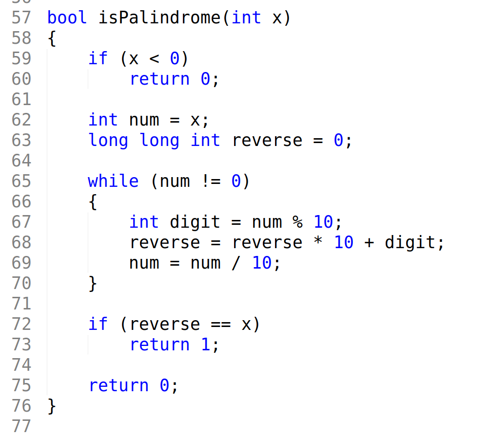
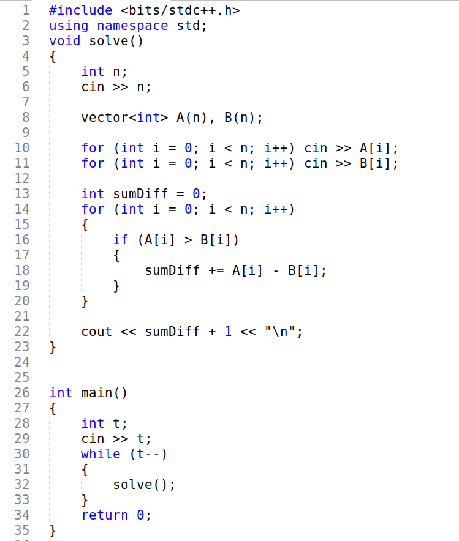

# Text Mate Theme (Sublime Text)
A clean and simple color scheme for Sublime Text.

## 📸 Screenshots

  

  

## Installation (Manual)

1. Download this repo as ZIP and extract it.

2. Copy `Text-Mate.sublime-color-scheme` into your Sublime **User** folder.

   👉 You can reach the **User** folder directly from Sublime:
   **Preferences > Browse Packages... > User**

   Or manually:

   * **Linux:** `~/.config/sublime-text/Packages/User/`
   * **Windows:** `%AppData%\Sublime Text\Packages\User\`
   * **macOS:** `~/Library/Application Support/Sublime Text/Packages/User/`

3. Restart Sublime Text.

4. Go to:
   **Preferences → Select Color Scheme → Text-Mate**

## 💖 Support

If you enjoy this theme and want to support me:

* ☕ [Buy Me a Coffee](https://buymeacoffee.com/vivekgohel)
  

Thank you so much!

